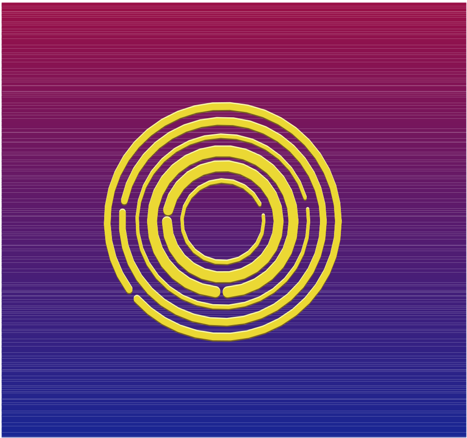
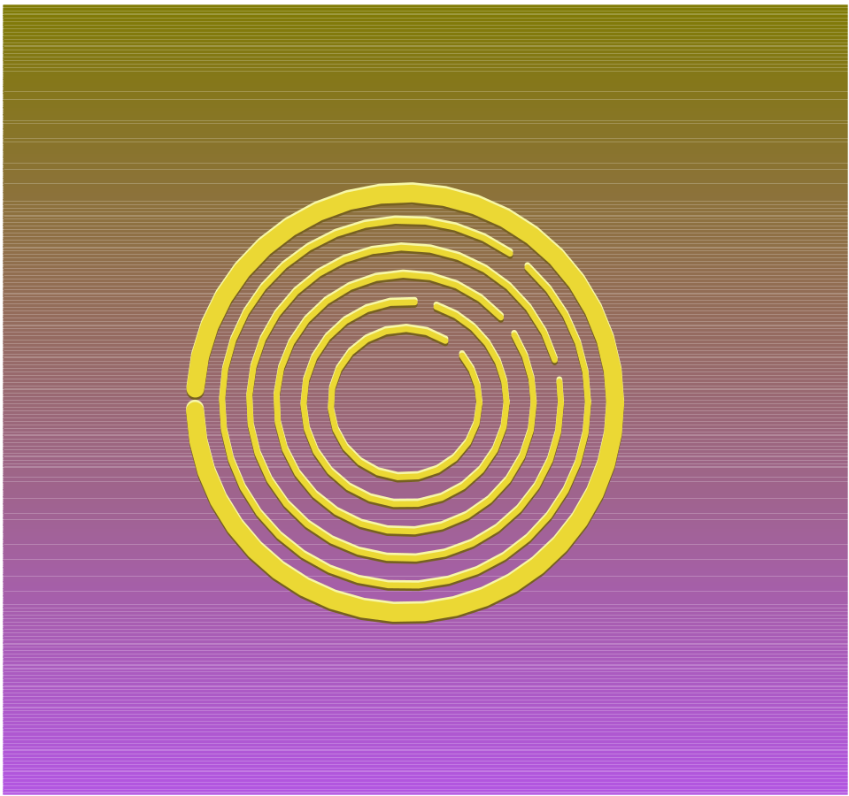
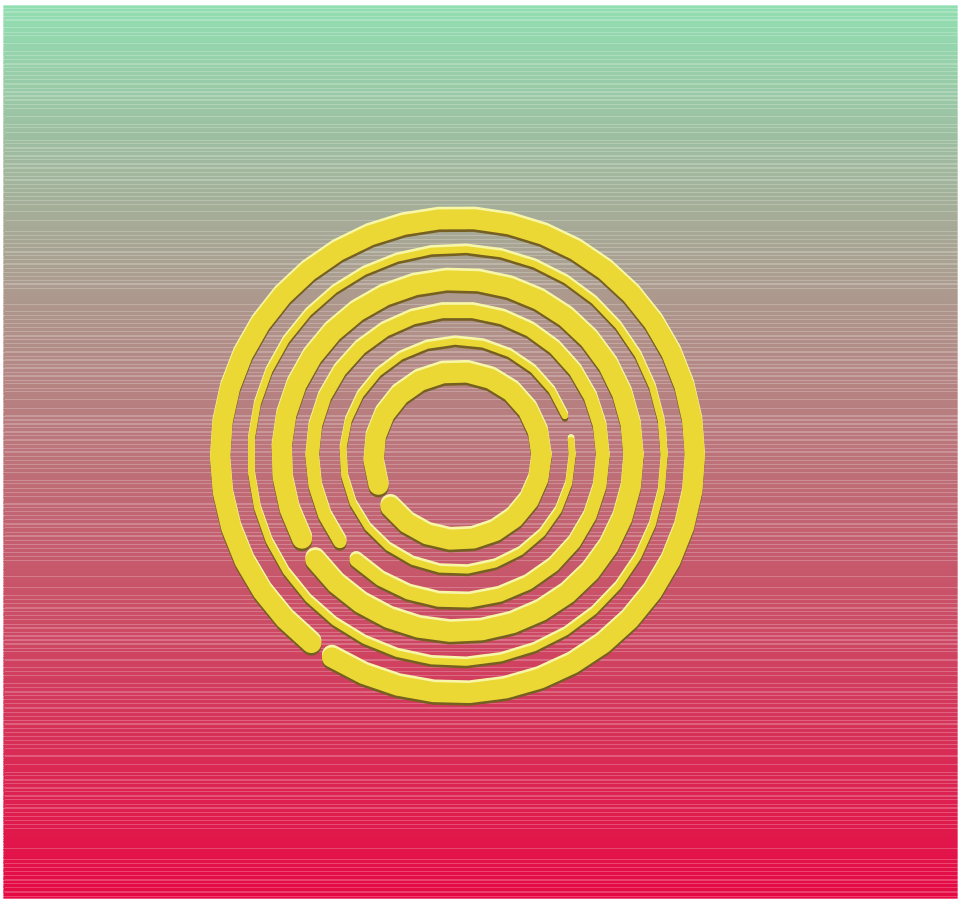

<h1>NFTY COIN</h1>

    The following images are the output of this Python-based program after successfull execution. 
    This program generates a random 6-character string then converts that into an image in the form of a 6-ring coin. 
    Each ring, regardless of diameter, corresponds to an ascii character from the random generated 6-character string. 
    The coin is always an embossed gold. The background is a gradient of two random colors. 

<table cellspacing=2>
    <tr>
        <td></td>
        <td></td>
        <td></td>
    </tr>
</table>
