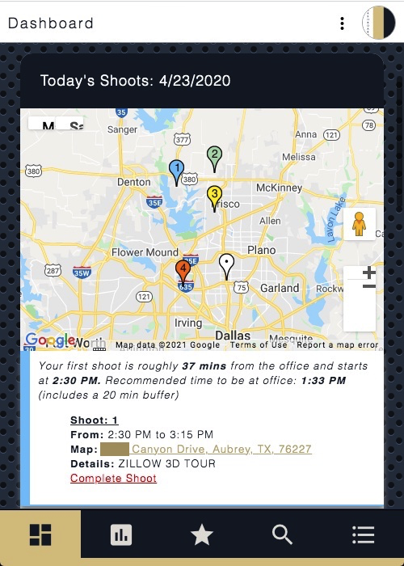
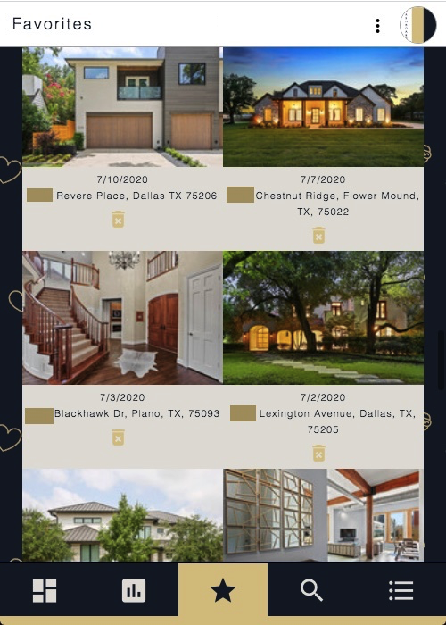
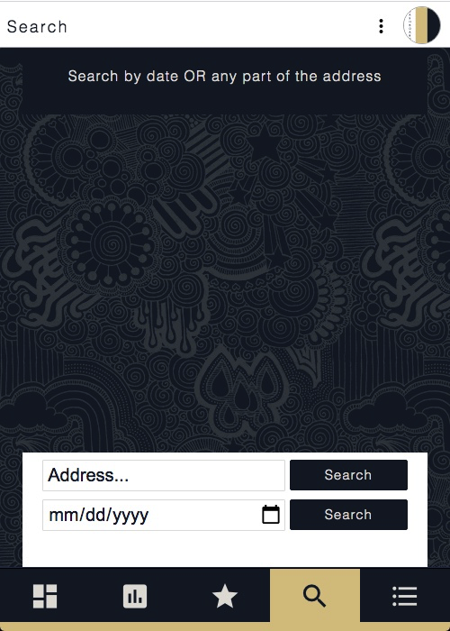
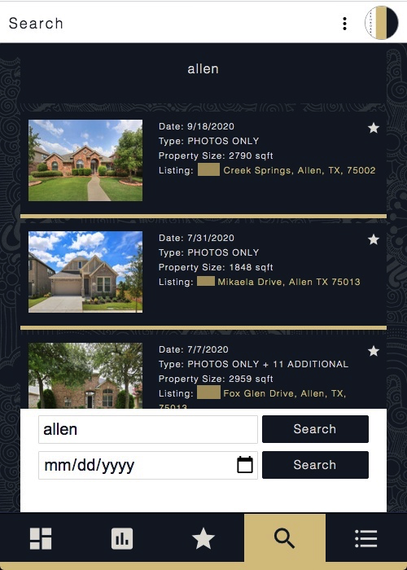

<link rel="stylesheet" type="text/css" href="../../res/styles.css"> 

<section>
    <h2>REP Dashboard</h2>
    <h3>Project Details</h3>
    

        An automated dashboard to display otherwise manually generated information used for Real Estate Photography and related processes. REP Dashboard takes photoshoot information from Google Calendar, aggregates it via Google Sheets, then presents it dynamically as a web app. When used, this centralized hub eliminated approximately 10 hours a month in manual data entry, provided data insights over time (like a heat map), and improved time management. 
         
         
        <strong>Note:</strong> "REP" is an acronym for real estate photographer. "REP Dashboard" was changed from its original name to avoid copyrighting.
    

</section>

 
<blockquote>
    <h3>User Interface</h3>
    The user interface features a top header and a bottom navigation. The botton nav has five tabs each with their own purpose. Below are screenshots and functionality discriptions of each tab.
     
     
    <strong>Interactive Features:</strong>
    <em>Add To Favorites • Delete From Favorites • Search Old Shoots • Select Different Time Ranges For Pay And Mileage</em>
    

        <h4>Dashboard</h4>
        <ul>
            <li>Display shoots from previous workday.</li>
                <li class="feature">Feature: <i>Add To Favorites</i></li>
            <li>Display each day's shoots on a Google Map as a numbered pin.</li>
            <li>List details and location for each day's shoots.</li>
            <li>List projected pay and mileage for each day.</li>
            <li>Show upcoming shoots and details.</li>
            <li>Show most used resource links.</li>
        </ul> 
        

            
            
             
            
            
        
  
    
 
    

    

        <h4>Photographer Stats</h4>
        <ul>
            <li>Display user's accumilated pay and mileage in an interactive selector.</li>
            <li class="feature">Feature: <i>Toggle Through Different Time Ranges</i></li>
            <li>Display user's accumilated photoshoot total.</li>
            <li>Display more accumilative user statistics.</li>
        </ul> 
        

            
            
        
  
    
 
    

        <h4>Favorites</h4>
        <ul>
            <li>Display user's favorited shoots.</li>
            <li class="feature">Feature: <i>Delete From Favorites</i></li>
        </ul> 
        

            
        
  
    
  
    

        <h4>Search</h4>
        <ul>
            <li>Query user's previous shoots via date or partial address.</li>
            <li class="feature">Feature: <i>Search</i></li>
            <li class="feature">Feature: <i>Add To Favorites</i></li>
        </ul> 
        

            
            
            
        
  
    
 
            

        <h4>Resources</h4>
        <ul>
            <li>Display photographer resources.</li>
        </ul> 
        

            
        
  
    
 

</blockquote>